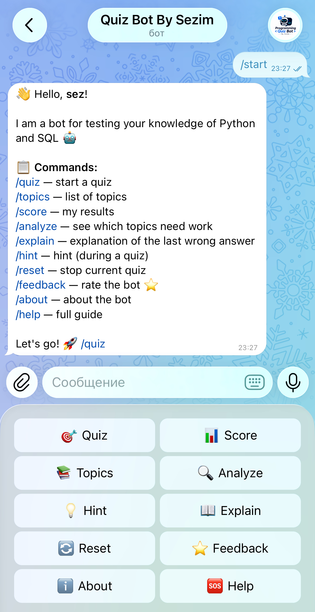
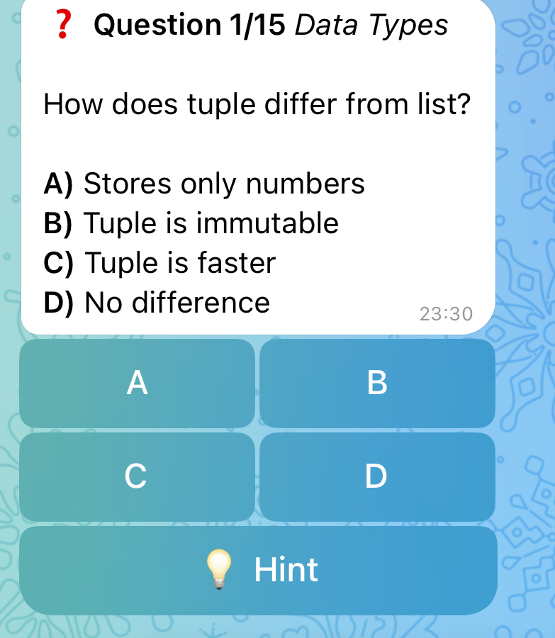
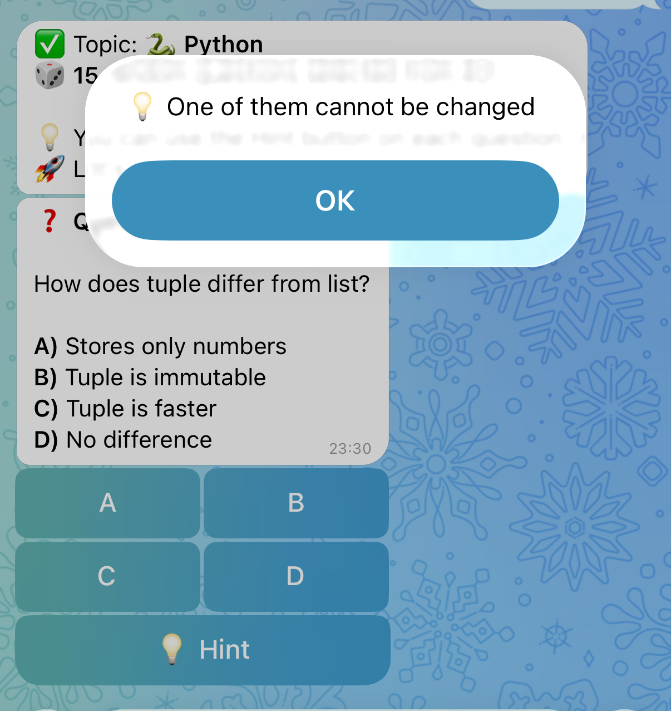
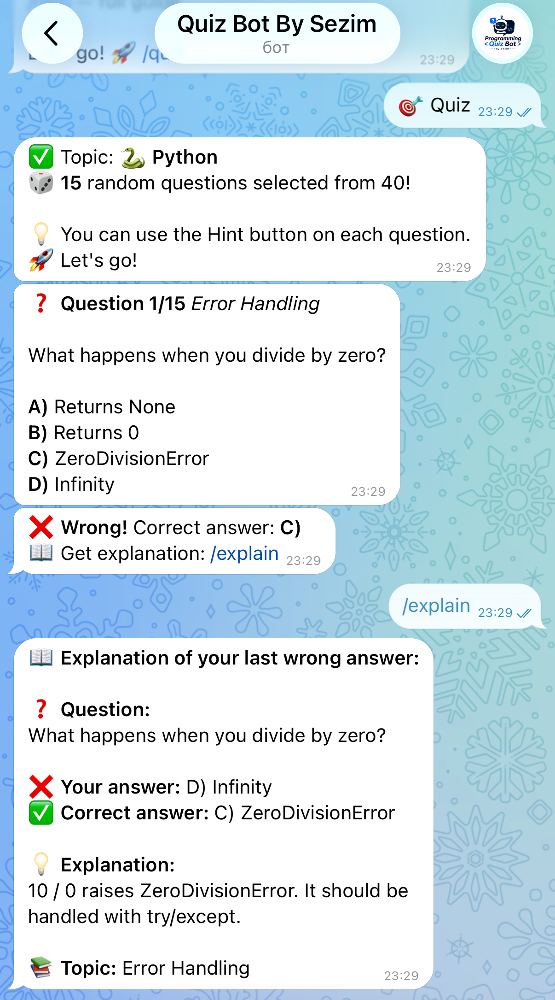
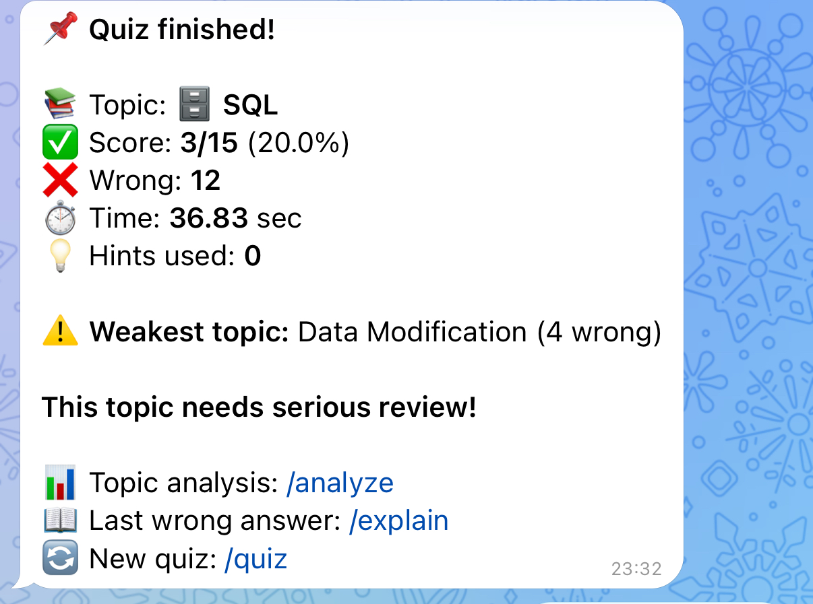
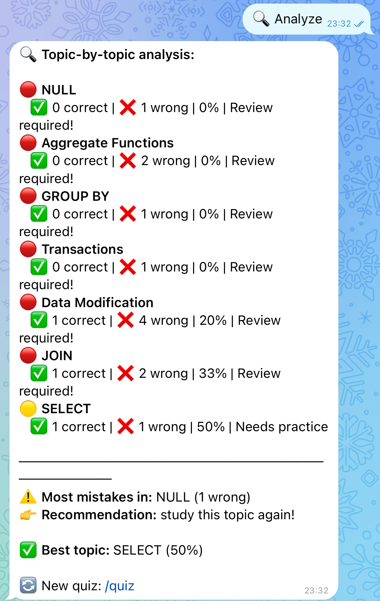

# 🤖 Programming Quiz Bot (Telegram)

## 📌 Project Name

**Programming Quiz Bot — Telegram Bot for Python & SQL Testing**

---

## 📖 Project Description

This project is a Telegram bot that allows users to test their knowledge of **Python** and **SQL** through interactive quizzes.

The bot:

* Asks **random questions** from a built-in database
* Provides **instant feedback**
* Tracks **user performance**
* Shows **topic-based analysis**
* Saves results using **Django + SQLite**

---

## 🛠 Technologies Used

* **Python 3.x**
* **Django** (ORM + database)
* **SQLite**
* **pyTelegramBotAPI (telebot)**
* **Telegram Bot API**

---

## Installation Instructions

### 1. Clone the repository

```bash
git clone https://github.com/dsezimm/quiz-bot.git
cd quiz-bot
```

### 2. Create virtual environment

```bash
python3 -m venv venv
source venv/bin/activate   # Mac/Linux
venv\Scripts\activate      # Windows
```

### 3. Install dependencies

```bash
pip install -r requirements.txt
```

### 4. Setup Django database

```bash
cd quiz_django
python manage.py migrate
```

---

##  Run Instructions

### 1. Set Telegram Bot Token

```bash
export BOT_TOKEN=your_token_here   # Mac/Linux
set BOT_TOKEN=your_token_here      # Windows
```

### 2. Run Django (optional for admin)

```bash
python manage.py runserver
```

### 3. Run the bot

```bash
cd bot
python bot.py
```

---

## Bot Commands

| Command   | Description                 |
| --------- | --------------------------- |
| /start    | Main menu                   |
| /quiz     | Start quiz                  |
| /topics   | List topics                 |
| /score    | View results                |
| /analyze  | Weak topics analysis        |
| /explain  | Explanation of wrong answer |
| /hint     | Get hint                    |
| /reset    | Stop quiz                   |
| /feedback | Rate bot                    |
| /about    | About project               |
| /help     | Full guide                  |

---

##  Example Bot Usage

### Starting the bot

```
User: /start
Bot: Hello! Choose a command 🚀
```

### Quiz flow

```
User: /quiz
Bot: Choose topic → Python / SQL

Bot: Question 1/15
Which function prints text in Python?
A) echo()
B) print()
C) write()
D) output()

User clicks: B
Bot: ✅ Correct!
```

### After quiz

```
📌 Quiz finished!

Score: 12/15 (80%)
Weakest topic: Loops
```

---

## 📊 Features

* 🎯 15 random questions per quiz
* 💡 Hints system
* 📖 Explanations for mistakes
* 📊 Topic-based analytics
* 🏆 Score tracking
* ⭐ User feedback system

---

## 🖼 Interface Screenshots

### 🔹 Main Menu
<p align="center">
  
</p>

---

### 🔹 Quiz Questions
<p align="center">
  
  
  
</p>

---

### 🔹 Results
<p align="center">
  
  
</p>

---

## 👨‍💻 Author

**dsezimm**

Final project for Python course, 2026

---

## 🔗 GitHub

https://github.com/dsezimm/quizbyszm_bot

---
